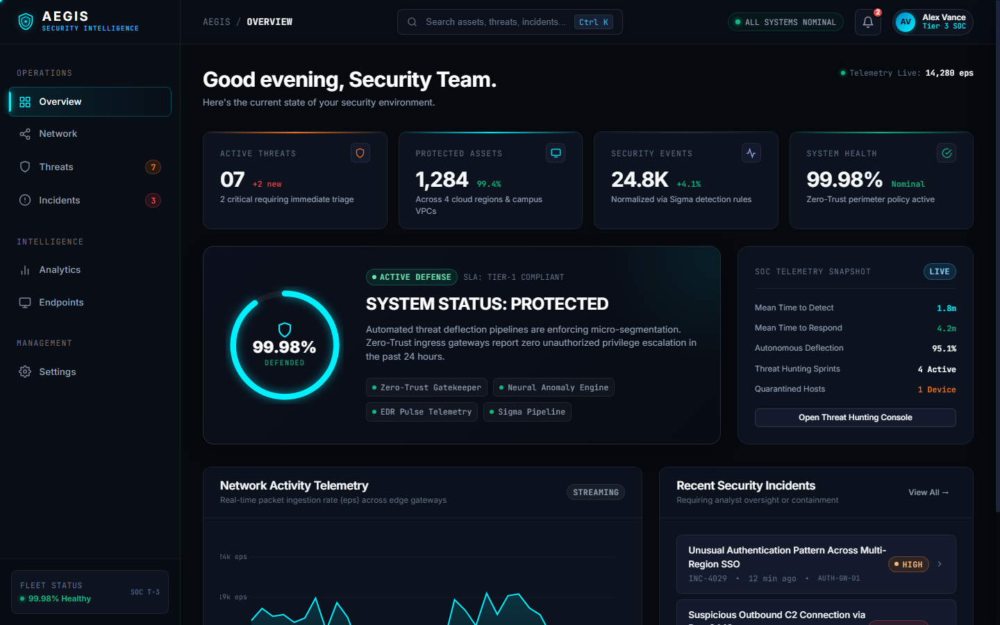
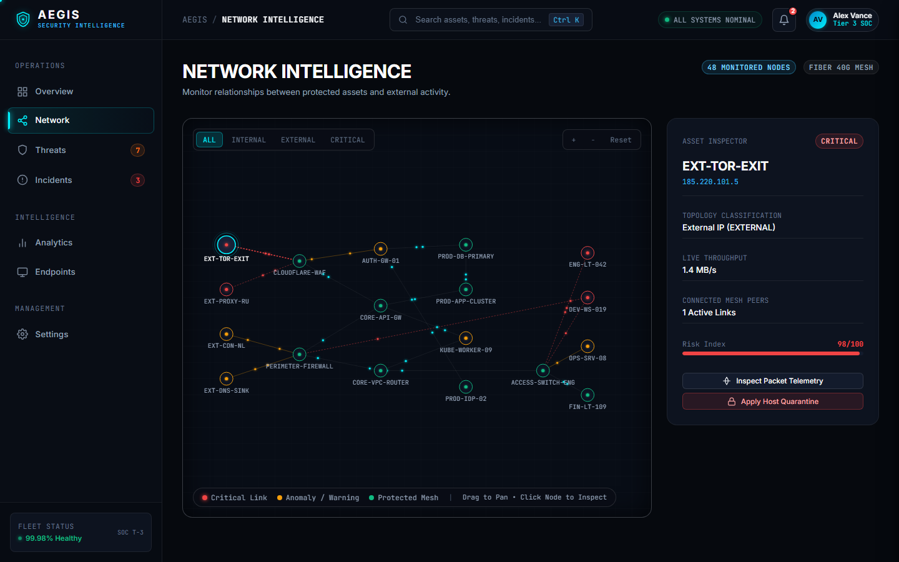
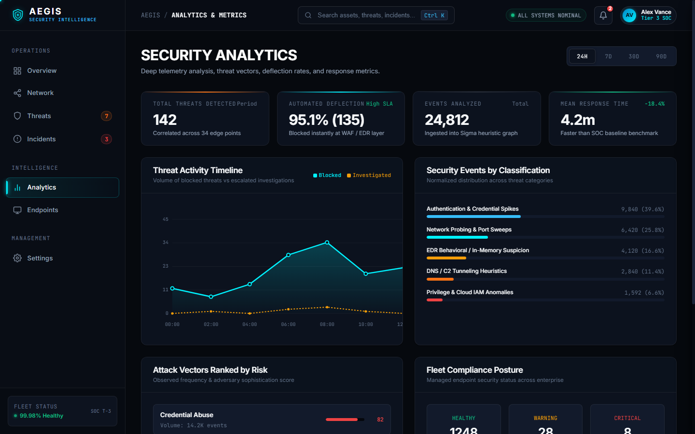

# AEGIS — Security Intelligence Platform

> **Next-Generation Security Operations Center (SOC) & Cyber Intelligence Web Platform**

AEGIS is an enterprise-grade, fictional cybersecurity intelligence platform designed for modern Security Operations Centers (SOC). It demonstrates high-density technical user experience, responsive multi-page architecture, interactive network topology mapping, real-time telemetry charting, automated threat triage, and incident lifecycle management.

Built purely with **semantic HTML5, modern CSS3 custom properties, and modular Vanilla JavaScript (ES6+)**. Zero external UI framework dependencies.

---

## 🖥️ Platform Showcase



<p align="center">
  
  
</p>

---

## 🛡️ Architecture & Key Capabilities

### 1. Global Application Shell & Routing
- **Client-Side SPA Architecture**: Instant view transitions with browser history, hash routing (`#/overview`, `#/network`, `#/threats`, `#/incidents`, `#/analytics`, `#/endpoints`, `#/settings`), and direct bookmarkable URLs.
- **Deep Linking**: Direct query parameter deep-linking support (`?threat=THR-8089`, `?incident=INC-4028`, `?endpoint=ENG-LT-042`, `?palette=open`).
- **Command Palette (`Ctrl + K`)**: Global modal search across all routes, assets, threat IDs, and active incidents with keyboard navigation.
- **Real-Time SOC Audio Feedback**: Synthesized Web Audio API sound effects (880Hz clicks, alert chimes, containment confirmations) with user toggle in Settings.
- **Precision Desktop Reticle Cursor**: Interactive custom cursor with trailing ring that smoothly expands over interactive controls (disabled on touch & `prefers-reduced-motion`).

### 2. Operations Overview Dashboard (`/overview`)
- **Radial Deflection Gauge**: Circular SVG health visualization tracking `99.98% DEFENDED` status and active defense engine states (Zero-Trust Gatekeeper, Neural Anomaly Engine, EDR Pulse Telemetry, Sigma Pipeline).
- **Core Security KPIs**: Active Threats (`07`), Protected Assets (`1,284`), Security Events (`24.8K`), and System Health (`99.98%`).
- **Real-Time Activity Telemetry**: Canvas wave chart with dynamic packet ingestion stream (`eps`) and threshold monitoring.
- **Live Incidents Stream**: Fast triage feed displaying priority badges, relative time stamps, and affected assets.

### 3. Network Intelligence (`/network`)
- **Interactive Topology Canvas**: High-DPI HTML5 Canvas rendering multi-tier topology (External Ingress, Perimeter Gateways, Core Clusters, Microservices, and Endpoints).
- **Animated Packet Telemetry**: Real-time particles streaming along connection links with color-coded status (Normal Cyan, Warning Amber, Critical Red).
- **Live Asset Inspector**: Side-panel telemetry detailing IP address, classification, latency, throughput, connected mesh peers, and risk index.
- **Controls & Filtering**: Smooth pan/zoom controls and topology filters (`ALL`, `INTERNAL`, `EXTERNAL`, `CRITICAL`).

### 4. Threat Intelligence (`/threats`)
- **High-Density Detections Table**: Sortable, filterable threat inventory with severity indicators (`CRITICAL`, `HIGH`, `MEDIUM`, `LOW`), detection timestamps, and status badges.
- **Detailed Investigation Drawer**: Slide-over forensic dossier featuring:
  - MITRE ATT&CK tactic & technique mapping.
  - Indicators of Compromise (IoCs: Hashes, Domains, C2 IPs).
  - Multi-stage investigation timeline with timestamps.
  - Interactive containment actions (*"Enforce Containment"*, *"Export STIX 2.1"*).

### 5. Incident Center (`/incidents`)
- **Triage Pipeline**: 4-stage visual incident lifecycle tracker (`Detected` &rarr; `Triaged` &rarr; `Contained` &rarr; `Remediated`).
- **Tabbed Status Workflow**: `ALL`, `ACTIVE`, `INVESTIGATING`, and `RESOLVED` with live count badges.
- **Forensic Case File**:
  - Response SLA remaining countdown timers.
  - Interactive containment checklist with real-time toggleable checkboxes.
  - Analyst Notes Log with live comment posting form.

### 6. Security Analytics (`/analytics`)
- **Dynamic Timeframe Filters**: Toggle seamlessly between `24H`, `7D`, `30D`, and `90D` with instant chart updates.
- **Threat Activity Canvas Plot**: Multi-series area chart plotting blocked threats vs. escalated investigations with crosshair hover tooltips.
- **Security Events by Classification**: Horizontal breakdown bars with percentage and volume indicators.
- **Ranked Attack Vectors**: Severity-scored vector cards (Credential Abuse, API Exploitation, C2 Beaconing, Malware Droppers).
- **Fleet Compliance Posture**: Tri-state breakdown of healthy, warning, and critical enterprise devices.

### 7. Endpoint Security (`/endpoints`)
- **Fleet Inventory**: Multi-platform asset inventory (Windows 11, Ubuntu LTS, macOS Sonoma, Debian, Alpine Linux).
- **Endpoint Deep-Dive**: Hardware specs, open listening sockets, active processes with cryptographic signer verification, and one-click host isolation.

### 8. Platform Settings (`/settings`)
- **SOC Configuration**: Timezone selection (UTC, EST, PST, GMT), telemetry ingest frequency, and archival windows.
- **Alert Escalation Routing**: PagerDuty, Slack webhooks, SMS emergency dispatch, and daily executive briefing toggles.
- **Security & Access**: Session timeouts, FIDO2 WebAuthn enforcement, dual-custody authorization, and API key rotation.
- **Persistence**: Simulated preferences persisted to `localStorage`.

---

## ⌨️ Global Keyboard Shortcuts

| Shortcut | Action |
| :--- | :--- |
| `Ctrl + K` or `Cmd + K` | Open Global Command Palette |
| `Escape` | Close Slideover Drawer / Modal |
| `1` | Switch to Overview Dashboard |
| `2` | Switch to Network Intelligence |
| `3` | Switch to Threat Intelligence |
| `4` | Switch to Incident Center |
| `5` | Switch to Security Analytics |
| `6` | Switch to Endpoint Security |
| `7` | Switch to Platform Settings |

---

## 📁 Project Structure

```
d:/AEGIS/
├── index.html                   # Primary application entrypoint and view shell
├── pages/                       # Direct route entrypoints
│   ├── network.html
│   ├── threats.html
│   ├── incidents.html
│   ├── analytics.html
│   ├── endpoints.html
│   └── settings.html
├── css/
│   ├── variables.css            # Dark SOC tokens, color scales, typography & elevations
│   ├── base.css                 # CSS reset, accessible focus rings & custom cursor
│   ├── layout.css               # Shell grid, fixed sidebar, topbar & slideover drawer
│   ├── components.css           # Buttons, badges, metric cards, tables & toggles
│   ├── dashboard.css            # Radial gauge, timeline plots, canvas cards & mitre boxes
│   └── responsive.css           # Breakpoints for desktop, tablet (768px) & mobile (390px)
├── js/
│   ├── data.js                  # Simulated enterprise SOC cybersecurity dataset
│   ├── navigation.js            # Client-side routing, Web Audio chimes & command palette
│   ├── network.js               # Interactive canvas topology map & animated packet particles
│   ├── threats.js               # Threat filtering, search, sorting & STIX export
│   ├── incidents.js             # Incident triage, lifecycle stages & analyst note logs
│   ├── analytics.js             # High-performance canvas charts & dynamic range filters
│   ├── endpoints.js             # Managed fleet inventory & network isolation controls
│   ├── settings.js              # Platform preferences, audio testing & API key rotation
│   └── app.js                   # Application bootstrap, heartbeat ticker & deep linking
└── README.md
```

---

## 🚀 Running the Application Locally

Since AEGIS is built with standard web technologies, it can be run using any lightweight web server:

### Option 1: Python
```bash
python -m http.server 8080
```
Then navigate to: `http://localhost:8080`

### Option 2: Node / npx
```bash
npx serve .
```

### Option 3: Direct File
You can also open `index.html` directly in any modern desktop browser.
